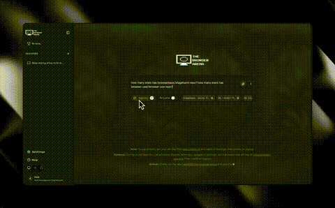

# The Browser Arena

Compare AI browser automation agents side-by-side. Submit a task, watch agents run in real-time, and compare speed, cost, and success.




## What it does

- **Multi-agent runs**: Browser-Use, Smooth, Stagehand (local & cloud)
- **Live comparison**: Parallel execution with browser views
- **Metrics built-in**: Time, steps, cost, success
- **History & replay**: Sessions are saved automatically
- **Multi-LLM**: OpenAI, Gemini, Claude

## Quick start

1) Install and run the web app
```bash
npm install
npm run dev
```

2) Start the agent server (Python)
```bash
cd agents
source .venv/bin/activate
uv sync        # or: pip install -r requirements.txt
python server.py
```

3) Create `.env.local`
```env
# Convex
NEXT_PUBLIC_CONVEX_URL=https://your-deployment.convex.cloud
CONVEX_DEPLOYMENT=your-deployment

# LLMs (add at least one)
OPENAI_API_KEY=...
GOOGLE_API_KEY=...
ANTHROPIC_API_KEY=...
BROWSER_USE_API_KEY=...

# Optional services
SMOOTH_API_KEY=...
BROWSERBASE_API_KEY=...
BROWSERBASE_PROJECT_ID=...

# Agent server
AGENT_SERVER_URL=http://localhost:8080
STAGEHAND_SERVER_URL=http://localhost:3001
```

4) Convex (first time)
```bash
npx convex auth
npx convex dev
```

Open http://localhost:3000
