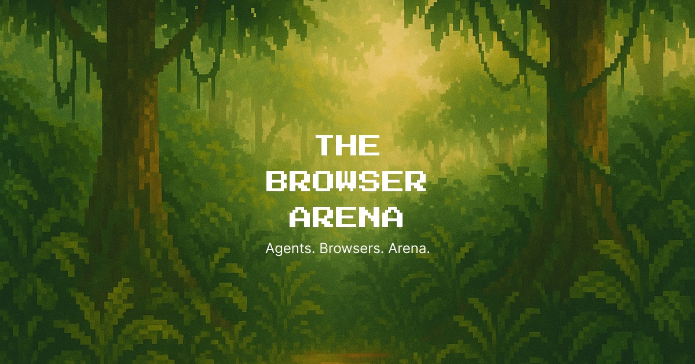
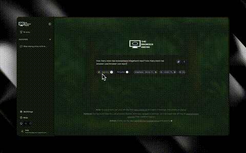

<div align="center">

**Compare AI browser automation agents side-by-side. Submit a task, watch agents run in real-time, and compare speed, cost, and success.**

[](LICENSE)



**[⭐ Star this repo](https://github.com/kalil0321/the-browser-arena)** if you find it useful! It helps others discover the project.

[🚀 Live Demo](https://www.thebrowserarena.com) • [📖 Documentation](#) • [🐛 Report Bug](https://github.com/kalil0321/the-browser-arena/issues) • [💡 Request Feature](https://github.com/kalil0321/the-browser-arena/issues)

</div>

---

## ✨ Features

### 🤖 Multi-Agent Support
- **Browser-Use** - Multi-step browser automation with LLM reasoning
- **Smooth** - AI-powered web automation
- **Stagehand** - Local and cloud browser automation
- **Notte** - Cloud browser sessions with live preview

### 📊 Real-Time Comparison
- **Parallel execution** - Watch multiple agents work simultaneously
- **Live browser views** - See exactly what each agent is doing
- **Built-in metrics** - Time, steps, cost, and success rate tracking
- **Session history** - All runs are automatically saved

### 🔧 Flexible Configuration
- **Multi-LLM support** - OpenAI, Google Gemini, Anthropic Claude
- **Cost tracking** - Monitor API usage and expenses

---

## 🚀 Quick Start

### Prerequisites

- Node.js 18+ and npm
- Python 3.12+
- A Convex account ([sign up free](https://convex.dev))
- At least one LLM API key (OpenAI, Google, or Anthropic)

### Installation

1. **Clone the repository**
```bash
git clone https://github.com/kalil0321/the-browser-arena.git
cd the-browser-arena
```

2. **Install dependencies**
```bash
# Install web app dependencies
npm install

# Install agent server dependencies
cd agents
uv sync  # or: pip install -r requirements.txt
cd ..
```

3. **Set up Convex**
```bash
npx convex auth
npx convex dev
```

4. **Configure environment variables**

Create `.env.local` in the project root:

```env
# Convex (required)
NEXT_PUBLIC_CONVEX_URL=https://your-deployment.convex.cloud
CONVEX_DEPLOYMENT=your-deployment

# LLMs (add at least one)
OPENAI_API_KEY=sk-...
GOOGLE_API_KEY=...
ANTHROPIC_API_KEY=...

# Browser automation services
BROWSER_USE_API_KEY=...          # Optional
SMOOTH_API_KEY=...               # Optional
BROWSERBASE_API_KEY=...          # Optional
BROWSERBASE_PROJECT_ID=...       # Optional

# Agent servers
AGENT_SERVER_URL=http://localhost:8080
STAGEHAND_SERVER_URL=http://localhost:3001
```

5. **Start the services**

Terminal 1 - Web app:
```bash
npm run dev
```

Terminal 2 - Agent server:
```bash
cd agents
source .venv/bin/activate
python server.py
```

Terminal 3 - Stagehand server:
```bash 
cd stagehand
npm i
npx tsx src/index.ts # if you have tsx 
# OR vercel dev
```

6. **Open your browser**

Navigate to [http://localhost:3000](http://localhost:3000)

---

## 📖 Usage

1. **Create a task** - Enter a browser automation instruction (e.g., "Find the cheapest flight from NYC to London")
2. **Select agents** - Choose which agents to compare
3. **Configure settings** - Set LLM models and other parameters
4. **Watch them run** - Observe agents execute in real-time with live browser views
5. **Compare results** - Review metrics, actions, and analyze performance

---

## 🤝 Contributing

Contributions are welcome! Here's how you can help:

1. 🐛 **Report bugs** - Open an issue with detailed information
2. 💡 **Suggest features** - Share your ideas for improvements
3. 🔀 **Submit PRs** - Fix bugs or add new features

## 🙏 Acknowledgments

We want to give credit to **BrowserArena** by Sagnik Anupam, Davis Brown, Shuo Li, Eric Wong, Hamed Hassani, and Osbert Bastani, who independently introduced a similar idea earlier in their paper *"BrowserArena: Evaluating LLM Agents on Real-World Web Navigation Tasks"* (October 2025).

This project was developed independently and without knowledge of their work at the time. We learned of it after the fact and want to acknowledge their prior contribution to the same research direction.

- 📄 Paper: [arXiv:2510.02418](https://arxiv.org/abs/2510.02418)
- 💻 Repository: [sagnikanupam/browserarena](https://github.com/sagnikanupam/browserarena)

If you use this project in academic work, please also consider citing their paper:

```bibtex
@misc{anupam2025browserarenaevaluatingllmagents,
  title={BrowserArena: Evaluating LLM Agents on Real-World Web Navigation Tasks},
  author={Sagnik Anupam and Davis Brown and Shuo Li and Eric Wong and Hamed Hassani and Osbert Bastani},
  year={2025},
  eprint={2510.02418},
  archivePrefix={arXiv},
  primaryClass={cs.AI},
  url={https://arxiv.org/abs/2510.02418}
}
```

---

## 📝 License

This project is licensed under the MIT License - see the [LICENSE](LICENSE) file for details.
