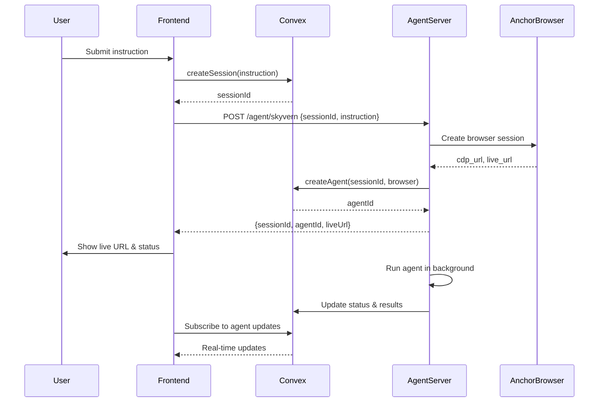

# Frontend Integration Guide

This guide shows how to integrate the Python agent server with your Next.js/React frontend.

## Prerequisites

1. Agent server running on `http://localhost:8000`
2. Convex backend running
3. User authenticated in frontend

## Integration Flow



## Frontend Code Examples

### 1. API Route Handler (Next.js App Router)

Create `/src/app/api/agent/run/route.ts`:

```typescript
import { NextRequest, NextResponse } from "next/server";

const AGENT_SERVER_URL = process.env.AGENT_SERVER_URL || "http://localhost:8000";

export async function POST(request: NextRequest) {
  try {
    const body = await request.json();
    const { sessionId, instruction, agent = "skyvern", providerModel = "" } = body;

    if (!sessionId || !instruction) {
      return NextResponse.json(
        { error: "sessionId and instruction are required" },
        { status: 400 }
      );
    }

    // Call Python agent server
    const agentEndpoint = `${AGENT_SERVER_URL}/agent/${agent}`;
    const response = await fetch(agentEndpoint, {
      method: "POST",
      headers: {
        "Content-Type": "application/json",
      },
      body: JSON.stringify({
        sessionId,
        instruction,
        providerModel,
      }),
    });

    if (!response.ok) {
      const error = await response.text();
      throw new Error(`Agent server error: ${error}`);
    }

    const data = await response.json();

    return NextResponse.json(data);
  } catch (error: any) {
    console.error("Error calling agent server:", error);
    return NextResponse.json(
      { error: error.message || "Failed to start agent" },
      { status: 500 }
    );
  }
}
```

### 2. React Component with Real-time Updates

```typescript
"use client";

import { useMutation, useQuery } from "convex/react";
import { api } from "@/convex/_generated/api";
import { useState } from "react";
import { Id } from "@/convex/_generated/dataModel";

export function AgentRunner() {
  const [instruction, setInstruction] = useState("");
  const [currentSessionId, setCurrentSessionId] = useState<Id<"sessions"> | null>(null);
  const [liveUrl, setLiveUrl] = useState<string | null>(null);
  const [loading, setLoading] = useState(false);

  const createSession = useMutation(api.mutations.createSession);
  const agents = useQuery(
    api.queries.getSessionAgents,
    currentSessionId ? { sessionId: currentSessionId } : "skip"
  );

  const runAgent = async (agentType: "skyvern" | "browser-use") => {
    if (!instruction.trim()) return;

    setLoading(true);
    try {
      // 1. Create session in Convex
      const result = await createSession({
        instruction: instruction.trim(),
      });

      const sessionId = result.sessionId;
      setCurrentSessionId(sessionId);

      // 2. Call Python agent server via our API route
      const response = await fetch("/api/agent/run", {
        method: "POST",
        headers: {
          "Content-Type": "application/json",
        },
        body: JSON.stringify({
          sessionId,
          instruction: instruction.trim(),
          agent: agentType,
          providerModel: agentType === "browser-use" ? "browser-use/bu-1.0" : "",
        }),
      });

      if (!response.ok) {
        throw new Error("Failed to start agent");
      }

      const data = await response.json();
      setLiveUrl(data.liveUrl);

      console.log("Agent started:", data);
    } catch (error) {
      console.error("Error running agent:", error);
      alert("Failed to start agent. Check console for details.");
    } finally {
      setLoading(false);
    }
  };

  const currentAgent = agents?.[0];

  return (
    <div className="space-y-4 p-6">
      <div className="space-y-2">
        <label className="block text-sm font-medium">Instruction</label>
        <textarea
          value={instruction}
          onChange={(e) => setInstruction(e.target.value)}
          placeholder="Enter your task... (e.g., Find the top post on hackernews)"
          className="w-full min-h-[100px] p-3 border rounded-lg"
          disabled={loading}
        />
      </div>

      <div className="flex gap-2">
        <button
          onClick={() => runAgent("skyvern")}
          disabled={loading || !instruction.trim()}
          className="px-4 py-2 bg-blue-600 text-white rounded-lg disabled:opacity-50"
        >
          {loading ? "Starting..." : "Run Skyvern"}
        </button>

        <button
          onClick={() => runAgent("browser-use")}
          disabled={loading || !instruction.trim()}
          className="px-4 py-2 bg-green-600 text-white rounded-lg disabled:opacity-50"
        >
          {loading ? "Starting..." : "Run Browser-Use"}
        </button>
      </div>

      {/* Live Browser View */}
      {liveUrl && (
        <div className="border rounded-lg p-4 space-y-2">
          <h3 className="font-semibold">Live Browser View</h3>
          <a
            href={liveUrl}
            target="_blank"
            rel="noopener noreferrer"
            className="text-blue-600 hover:underline"
          >
            {liveUrl}
          </a>
          <iframe
            src={liveUrl}
            className="w-full h-[600px] border rounded"
            title="Live Browser"
          />
        </div>
      )}

      {/* Real-time Agent Status */}
      {currentAgent && (
        <div className="border rounded-lg p-4 space-y-2">
          <h3 className="font-semibold">Agent Status</h3>
          <div className="grid grid-cols-2 gap-2 text-sm">
            <div>
              <span className="font-medium">Agent:</span> {currentAgent.name}
            </div>
            <div>
              <span className="font-medium">Status:</span>{" "}
              <span
                className={`px-2 py-1 rounded ${
                  currentAgent.status === "completed"
                    ? "bg-green-100 text-green-800"
                    : currentAgent.status === "failed"
                    ? "bg-red-100 text-red-800"
                    : currentAgent.status === "running"
                    ? "bg-blue-100 text-blue-800"
                    : "bg-gray-100 text-gray-800"
                }`}
              >
                {currentAgent.status}
              </span>
            </div>
          </div>

          {currentAgent.result && (
            <div className="mt-4">
              <h4 className="font-medium mb-2">Result:</h4>
              <pre className="bg-gray-50 p-3 rounded text-xs overflow-auto max-h-[300px]">
                {JSON.stringify(currentAgent.result, null, 2)}
              </pre>
            </div>
          )}
        </div>
      )}
    </div>
  );
}
```

### 3. Environment Variables

Add to your `.env.local`:

```bash
# Agent Server URL
AGENT_SERVER_URL=http://localhost:8000
```

### 4. Server Component Integration

```typescript
// app/session/[sessionId]/page.tsx
import { AgentRunner } from "@/components/agent-runner";

export default function SessionPage({
  params,
}: {
  params: { sessionId: string };
}) {
  return (
    <main className="container mx-auto py-8">
      <h1 className="text-3xl font-bold mb-6">Agent Arena</h1>
      <AgentRunner />
    </main>
  );
}
```

## Testing the Integration

1. **Start all services:**

```bash
# Terminal 1: Convex
npx convex dev

# Terminal 2: Agent Server
cd agents
./start.sh

# Terminal 3: Frontend
npm run dev
```

2. **Test the flow:**
   - Open browser to `http://localhost:3000`
   - Enter an instruction like "Find the top post on hackernews"
   - Click "Run Skyvern" or "Run Browser-Use"
   - Watch the live URL appear and see the agent work in real-time
   - See status updates appear as the agent runs

3. **Monitor:**
   - Agent server logs: Check terminal 2 for agent execution logs
   - Convex logs: Check terminal 1 for database updates
   - Browser network tab: See API calls to `/api/agent/run`

## Error Handling

The integration handles these error cases:

1. **Agent server down**: Shows error in frontend, doesn't crash
2. **Invalid session ID**: Agent server returns 404
3. **Agent execution fails**: Status updates to "failed" with error message
4. **Browser session fails**: Cleaned up automatically

## Production Deployment

For production:

1. **Deploy agent server** to a cloud provider (Railway, Render, etc.)
2. **Update AGENT_SERVER_URL** to production URL
3. **Add authentication** between frontend and agent server (API key, JWT, etc.)
4. **Set up monitoring** for agent execution (Sentry, DataDog, etc.)
5. **Configure rate limiting** to prevent abuse

Example production setup:

```typescript
// Authenticated API route
import { auth } from "@/lib/auth/server";

export async function POST(request: NextRequest) {
  const session = await auth();
  if (!session) {
    return NextResponse.json({ error: "Unauthorized" }, { status: 401 });
  }

  // Add API key for agent server
  const response = await fetch(`${AGENT_SERVER_URL}/agent/${agent}`, {
    method: "POST",
    headers: {
      "Content-Type": "application/json",
      "X-API-Key": process.env.AGENT_SERVER_API_KEY!,
    },
    body: JSON.stringify({ ... }),
  });

  // ... rest of code
}
```

## Troubleshooting

**CORS Issues:**

If you get CORS errors, make sure the agent server's CORS middleware allows your frontend origin:

```python
# In server.py
app.add_middleware(
    CORSMiddleware,
    allow_origins=["http://localhost:3000", "https://yourapp.com"],
    allow_credentials=True,
    allow_methods=["*"],
    allow_headers=["*"],
)
```

**Timeout Issues:**

For long-running tasks, consider adding timeouts and progress updates:

```typescript
// Set a reasonable timeout
const controller = new AbortController();
const timeoutId = setTimeout(() => controller.abort(), 300000); // 5 minutes

const response = await fetch("/api/agent/run", {
  signal: controller.signal,
  // ... other options
});
```

**Connection Issues:**

Verify all services are running:

```bash
# Check Convex
curl http://localhost:3000/api/health

# Check Agent Server
curl http://localhost:8000/

# Check if ports are in use
lsof -i :3000
lsof -i :8000
```

